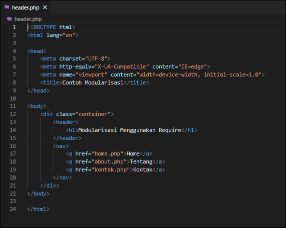
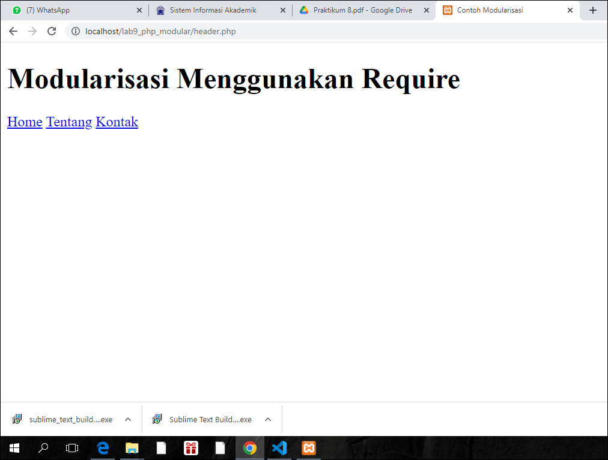
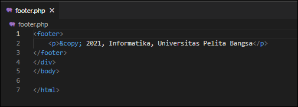
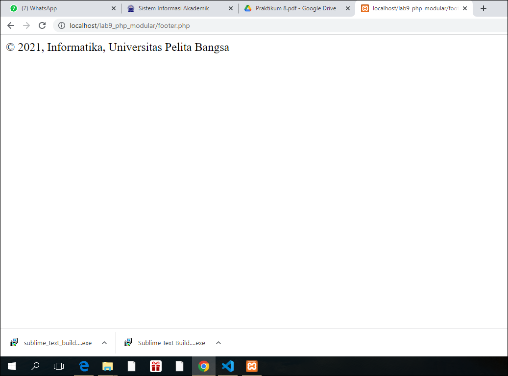
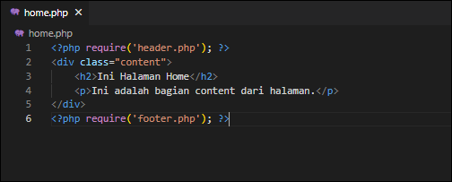
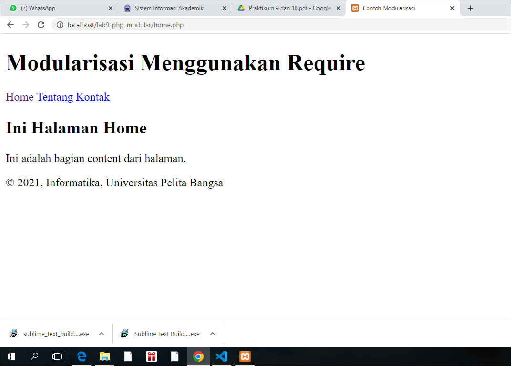
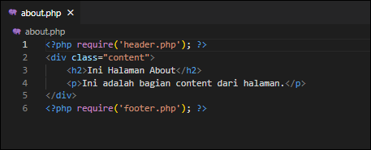
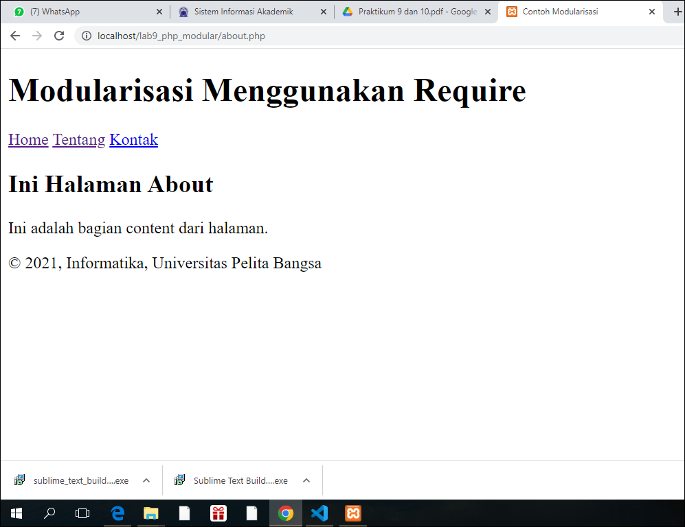

# Pratikum 9 pemrograman web
Repository ini dibuat untuk memenuhi tugas mata kuliah pemrograman web pertemuan ke 11.

Nama    : Aka erlanda

Nim     : 312010207

Kelas   : TI.20.B.1

# Lab9Web

<b>Persiapan</b>

Mempersiapkan text editor misalnya VSCode.

Selanjutnya Buat folder baru dengan nama lab9_php_modular pada docroot webserver
(htdocs)

<b>Langka-Langka Pratikum 9 pemrograman web</b>

1. Membuat file baru dengan nama <b>"Header.php"</b>

Selanjutnya buka chrome / browser ketik "localhost/lab9_php_modular/header.php".Berikut hasil outputnya :

2. Membuat file baru dengan <b>"nama footer.php"</b>

Lalu selanjut nya buka chrome / browser ketikan "localhost/lab9_php_modular/footer.php". Lihat hasil nya :

3. Buat file baru dengan "nama home.php"

Selanjutnya lihat hasil outputnya dengan mengklik "localhost/lab9_php_modular/home.php". lalu refresh chrome / browser nya. Dan lihat hasil nya :

4. Buat file baru dengan nama "about.php"

Lalu lihat hasil nya di chrome / browser dengan mengklik "localhost/lab9_php_modular/about.php". dan silah kan di refresh maka tampilan nya seperti berikut :

